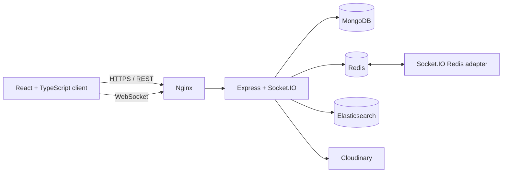

# TribeTalk

TribeTalk is a full-stack, real-time community chat application. Users create servers and channels, exchange text and image messages, invite and moderate members, search conversations, receive mentions, and stay synchronized across reconnects.

> Demo URL: add your deployed HTTPS URL here. Do not publish an administrator password or personal credentials.

## Highlights

- Real-time Socket.IO chat with optimistic delivery, retries, idempotent client IDs, channel sequences, reconnect recovery, and cursor pagination.
- Server invites with expiry, revocation, maximum-use limits, owner/moderator/member roles, and moderation audit events.
- Profiles, image avatars/message attachments through Cloudinary, presence, typing, mentions, notifications, reactions, threads, and pins.
- MongoDB as the source of truth; Redis for shared ephemeral state; Elasticsearch for full-text message search.
- Dockerized deployment through Nginx, structured Pino logs, request IDs, health checks, metrics, CI, and browser smoke tests.

## Architecture



## Stack

| Area | Technology | Use in TribeTalk |
| --- | --- | --- |
| Client | React, TypeScript, Redux Toolkit, Tailwind CSS | User interface, state, API cache, socket-driven UI |
| Realtime | Socket.IO | Rooms, reconnects, channel broadcasts, typing, message delivery |
| API | Node.js, Express | REST API, authentication, business rules |
| Primary data | MongoDB, Mongoose | Users, servers, messages, invites, notifications, audit logs |
| Ephemeral/distributed | Redis | Rate limits, presence TTLs, typing TTLs, Socket.IO adapter |
| Search | Elasticsearch | Full-text message search, separate derived index |
| Uploads | Cloudinary, Multer | Authenticated image uploads and delivery |
| Security | JWT, cookies, Helmet, Zod, express-rate-limit | Auth, headers, validation, API/socket abuse controls |
| Delivery | Docker Compose, Nginx | Repeatable local deployment, reverse proxy, WebSocket forwarding |
| Quality | Vitest, Supertest, Playwright, GitHub Actions | API tests, browser smoke tests, CI |
| Observability | Pino | JSON logs, request IDs, metrics, live demo admin view |

## Run locally with Docker

1. Create the backend environment file:

   ```powershell
   Copy-Item TribetalkBackend/.env.example TribetalkBackend/.env
   ```

2. Set strong values for `ACCESS_TOKEN_SECRET`, `REFRESH_TOKEN_SECRET`, and `ADMIN_PASSWORD`.

3. Start the stack:

   ```powershell
   docker compose up --build -d
   ```

4. Open [http://localhost:8080](http://localhost:8080).

Useful local routes:

- `http://localhost:8080/api/docs` — Swagger UI
- `http://localhost:8080/api/health` — dependency health
- `http://localhost:8080/admin` — interview/demo metrics dashboard; sign in using `ADMIN_PASSWORD`

Stop the stack with `docker compose down`. MongoDB, Redis, and Elasticsearch volumes persist unless you explicitly use `docker compose down -v`.

## Environment variables

| Variable | Purpose |
| --- | --- |
| `MONGODB_URI` | MongoDB connection |
| `ACCESS_TOKEN_SECRET`, `REFRESH_TOKEN_SECRET` | JWT signing secrets |
| `CORS_ORIGIN`, `COOKIE_SECURE` | Browser/deployment security settings |
| `REDIS_URL` | Shared Socket.IO, rate-limit, presence, and typing state |
| `ELASTICSEARCH_URL` | Search index connection |
| `CLOUDINARY_*` | Image upload configuration |
| `ADMIN_PASSWORD` | Temporary interview-dashboard sign-in password |
| `LOG_LEVEL` | Pino log level |

Never commit `.env` files or demo/admin passwords.

## Testing

```powershell
cd TribetalkBackend
npm test
npx playwright install chromium
npm run test:e2e
```

The Playwright suite expects the Docker app at `http://localhost:8080`; set `PLAYWRIGHT_BASE_URL` to target another environment. GitHub Actions installs dependencies, runs backend tests, builds the frontend, starts Docker Compose, and runs browser smoke tests.

## Deployment

The repository includes Docker and Nginx configuration for a single-host deployment. For HTTPS, point a domain at the host, obtain a Let's Encrypt certificate, set `PUBLIC_ORIGIN`, `COOKIE_SECURE=true`, and `DOMAIN`, then run:

```powershell
docker compose -f docker-compose.yml -f docker-compose.production.yml up --build -d
```

See [DEPLOYMENT.md](DEPLOYMENT.md) for details.

## Current limitations and next steps

- The Compose deployment is single-host, not highly available.
- Search indexing and notification generation are best-effort asynchronous work; production should use an outbox/queue with retries.
- The live admin dashboard is an interview-only observability view; a real implementation needs role-based administrator authorization and durable log aggregation.
- Planned improvements: responsive/accessibility polish, richer Swagger docs, larger integration/socket test coverage, durable observability, managed infrastructure, and background queues.
